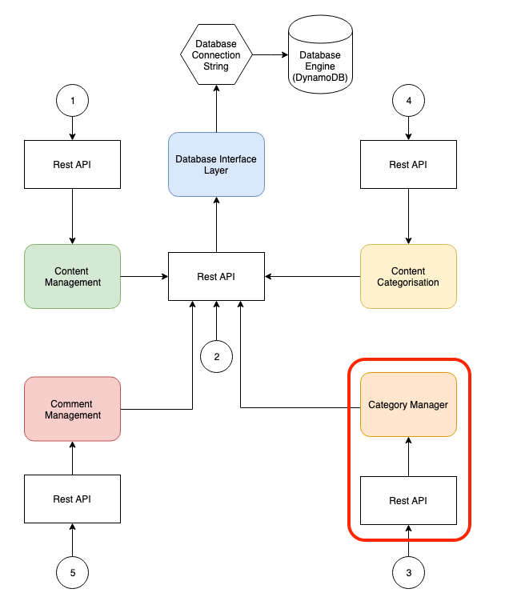
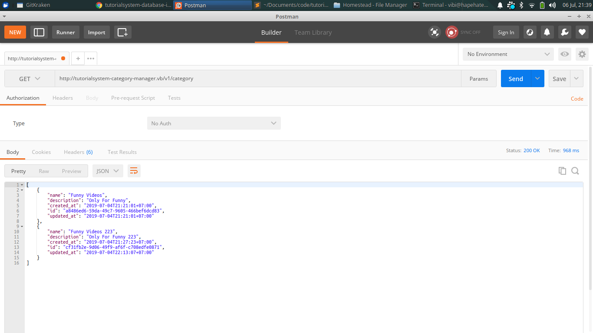
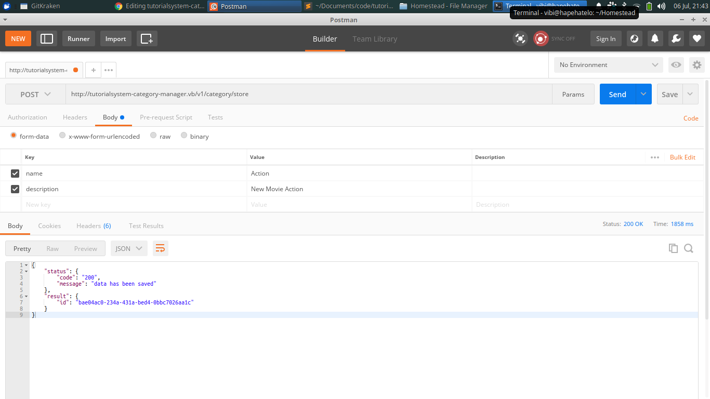
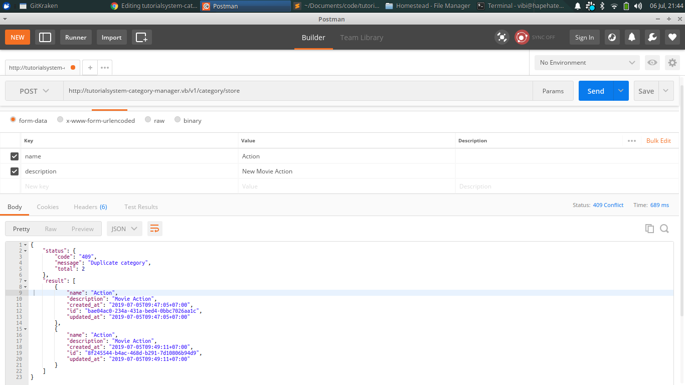
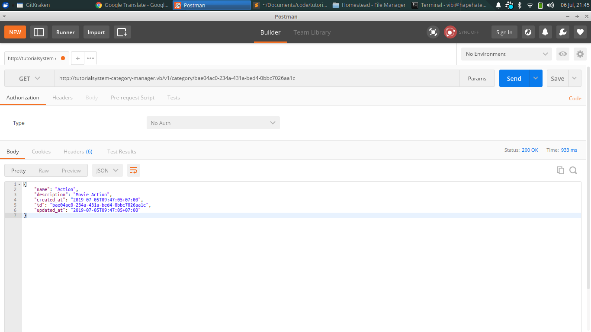
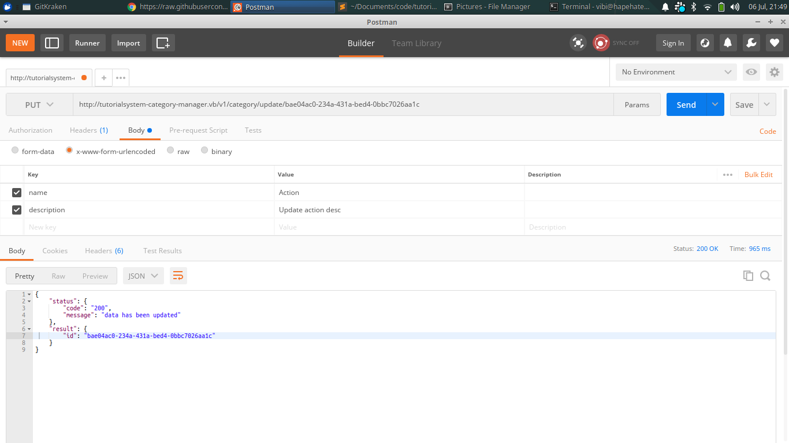
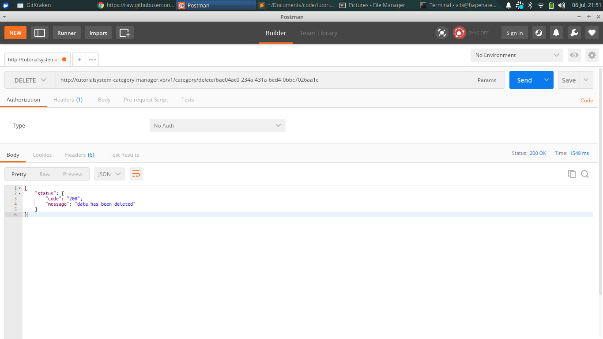
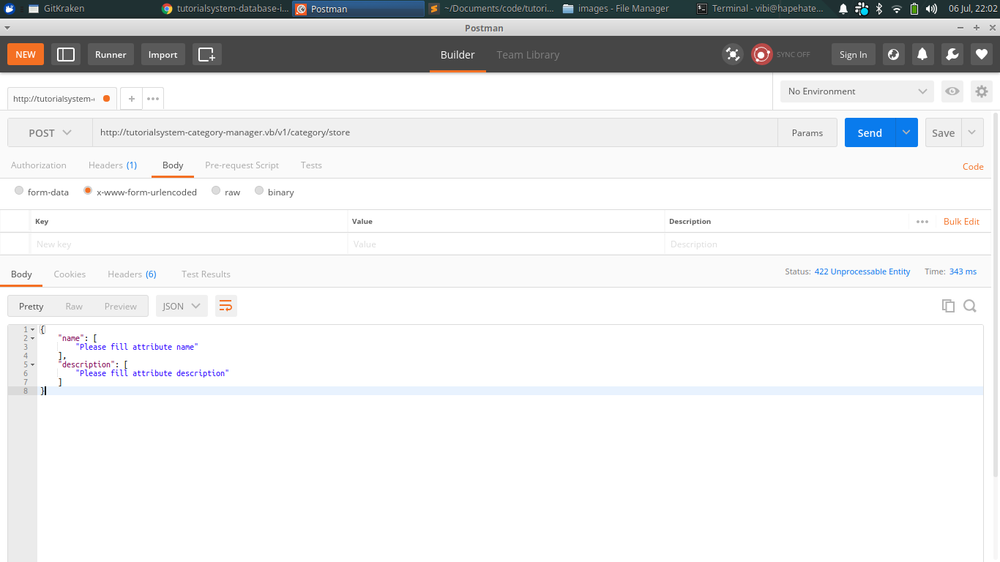

# Category Manager of Tutorial System

## Description 

Category Manager manages the input and output processes with simple validation from the frontend to the database interface layer section.

See Red highlight below for the scope of this repository.



## API END POINT
* http://example.com/v1

## API Docs
* https://cm27.docs.apiary.io/

## Table Structure End Points
| URL                            | Method | INFO              |
| ------------------------------ | ------ | ----------------- |
| `category`             | GET    | Get All Data      |
| `category/store`       | POST   | Save Data         |
| `category/{id}`        | GET    | Get Data by ID    |
| `category/search`      | GET   | Search Data Query |
| `category/update/{id}` | PUT    | Update Data by ID |
| `category/delete/{id}` | DELETE | Delete Data by ID |


## Example screen shots of API invocations

### [GET] Get Category


### [POST] Input Category Success


### [POST] Input Category Already Availale


### [GET] Get Detail Category


### [PUT] Update Category Success


### [PUT] Update Category Already Availale


### [DELETE] Delete Category


### [POST] Input Category Validation



## How to commit

When committing, precommit hook been called and expect tests and linting be passed first

### Commit message [Conventional Commits](https://conventionalcommits.org/).

The commit message should be structured as follows:

---

```bash
<squad abbreviation-ticket number> <type>(<scope>):  <description>
<BLANK LINE>
[optional body]
<BLANK LINE>
[optional footer]
```

---

## Examples

### Commit message with description, scope and breaking change in body

```bash
CM-21 feat(dbid): allow provided config object to extend other configs

CM-22 BREAKING CHANGE(dbid): redirect old API request service page to new version
```

### Revert

If the commit reverts a previous commit, it should begin with `revert:`, followed by the header of the reverted commit. In the body it should say: `This reverts commit <hash>.`, where the hash is the SHA of the commit being reverted.

### Type

Must be one of the following:

| type            | usage                                                                                                                                                                 |
| :-------------- | :-------------------------------------------------------------------------------------------------------------------------------------------------------------------- |
| fix             | A bug fix (this correlates with [PATCH](http://semver.org/#summary) in semantic versioning).                                                                          |
| feat            | A new feature (this correlates with [MINOR](http://semver.org/#summary) in semantic versioning).                                                                      |
| BREAKING CHANGE | introduces a breaking API change (correlating with [MAJOR](http://semver.org/#summary) in semantic versioning). A breaking change can be part of commits of any type. |
| chore           | bau taks                                                                                                                                                              |
| build           | Changes that affect the build system or external dependencies (example scopes: gulp, broccoli, npm, webpack)                                                          |
| ci              | Changes to our CI configuration files and scripts (example scopes: Travis, Circle, BrowserStack, SauceLabs)                                                           |
| docs            | Documentation only changes                                                                                                                                            |
| perf            | A code change that improves performance                                                                                                                               |
| refactor        | A code change that neither fixes a bug nor adds a feature                                                                                                             |
| style           | Changes that do not affect the meaning of the code (white-space, formatting, missing semi-colons, etc)                                                                |
| test            | Adding missing tests or correcting existing tests                                                                                                                     |

### Scope

The scope should be the name of the component package affected (as perceived by the person reading the changelog generated from commit messages.

The following is the list of supported scopes:

| Short Code | Components               |
| :--------- | :----------------------- |
| dbid       | Database Interface Layer |
| test       | Test automation          |
| doc        | Documentation            |
... keep adding above list
